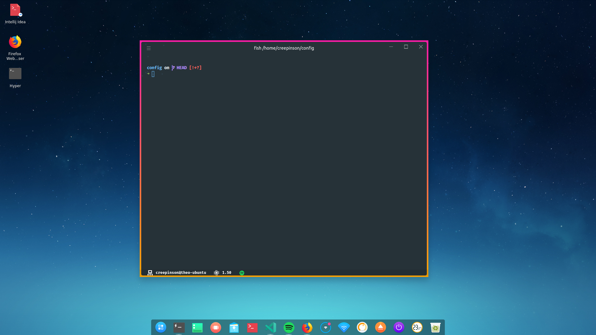

# Creepinson's Setup

## Shell & Terminal

I am using the fish shell along with the [Hyper Terminal](https://hyper.is) and some of the [awesome plugins](https://github.com/bnb/awesome-hyper) for Hyper.

## OS

I am running a mix of Ubuntu with Deepin intalled, alongside Windows 10 Pro... and if you are wondering, no, I did not pay $200 for a windows license key! Instead, I bought one from [g2deal](https://g2deal.com) for $14 and it works fine. Here is a screenshot of Ubuntu 18.04 + Deepin (it looks really nice):

