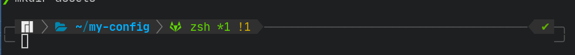

# Theo's Setup

## Development IDE

### Visual Studio Code

I have listed some of the main extensions I use in VSCode below:

- Prettier
- ESLint
- Error Lens
- Todo Tree
- Remote Development Extension Pack

### Neovim

[You can my lua configuration file here](dotfiles/.config/nvim/init.lua).

## Shell

I am using the zsh shell along with the powerlevel10k theme.
[Here is my zsh configuration file.](dotfiles/.zshrc)

## Operating System

I am running Arch Linux, alongside Windows 11 Pro. I use Arch Linux as my daily driver. For gaming and VR, I use my windows 11 installation.

## Window Manager

My Arch Linux installation is also running the bspwm window manager, along with polybar for a status bar and sxhkd for keybindings. 

